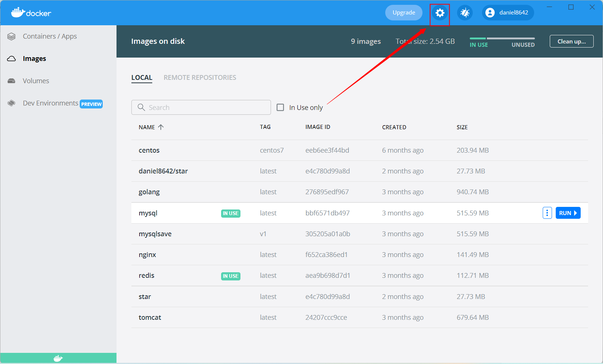
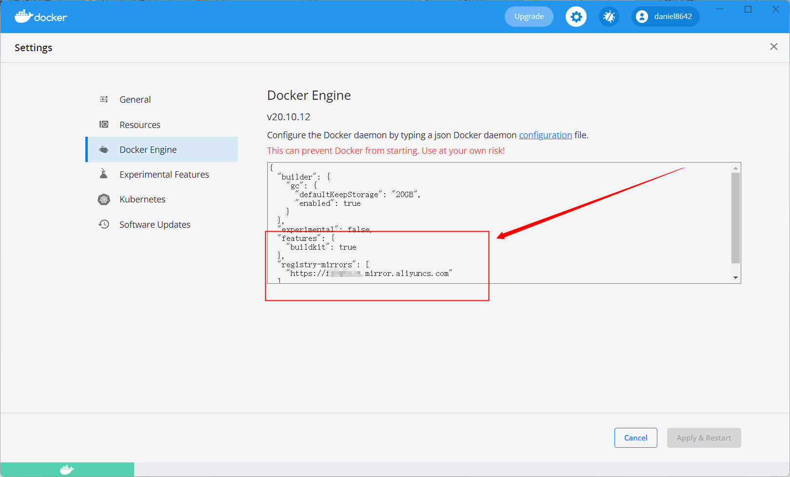
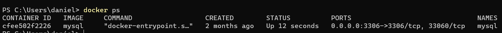

# 实验1容器: 实验环境准备(难度: 中)

王海涛19052164

## 1. 安装Docker

Docker 并非是一个通用的容器工具，它依赖于已存在并运行的 Linux 内核环境。

最新win版本是基于系统Linux子系统(WSL2)下的.

由于Docker Desktop for Windows 安装需要更改系统网卡设置, 常常和已安装好的虚拟机冲突. 如果系统原先有虚拟机(VMware, VirtualBox),建议在虚拟机上安装Ubuntu ,在Ubuntu 环境中安装

### Ubuntu 环境

验证环境版本:

| 系统版本       | CentOS 7.6 64bit         |
| -------------- | ------------------------ |
| docker软件版本 | Docker-ce 19.03.9        |
| 机器配置       | 腾讯云CPU: 1核 内存: 2GB |

1. 使用阿里云镜像下载

   ```
   curl -sSL http://acs-public-mirror.oss-cn-hangzhou.aliyuncs.com/docker-engine/internet | sh -
   ```

2. 安装需要的包

   ```
   sudo apt-get install linux-image-extra-$(uname -r) linux-image-extra-virtual
   ```

3. 添加使用 HTTPS 传输的软件包以及 CA 证书

   ```
   sudo apt-get update
   sudo apt-get install apt-transport-https ca-certificates 
   ```

4. 添加GPG密钥

   ```
   sudo apt-key adv --keyserver hkp://p80.pool.sks-keyservers.net:80 --recv-keys 58118E89F3A912897C070ADBF76221572C52609D
   ```

5. 添加软件源

   ```
   echo "deb https://apt.dockerproject.org/repo ubuntu-xenial main" | sudo tee /etc/apt/sources.list.d/docker.list
   ```

6. 添加成功后更新软件包缓存

   ```
   sudo apt-get update
   ```

7. 安装docker

   ```
   sudo apt-get install docker-engine
   ```

8. 启动 docker服务并设置开机启动

   ```
   sudo systemctl enable docker
   sudo systemctl start docker
   ```
   
### windows环境安装

验证环境版本:

| 系统版本       | Windows 11 专业版 21H2       |
| -------------- | ---------------------------- |
| docker软件版本 | Docker Desktop 4.5.1 (74721) |
| 机器配置       | 联想Y7000 i5-9300H 16.0 GB   |

1. 打开docker hub 下载Docker Desktop for Windows

   网址: https://hub.docker.com/editions/community/docker-ce-desktop-windows

   下载链接: https://desktop.docker.com/win/main/amd64/Docker%20Desktop%20Installer.exe

2. 按照提示安装docker

   可能因为系统缺乏wsl2导致失败,可以参照微软的文档解决: [安装 WSL ](https://docs.microsoft.com/zh-cn/windows/wsl/install)

   https://docs.microsoft.com/zh-cn/windows/wsl/install

3. docker默认会从国外下载镜像,更换镜像源可以加速镜像下载

   镜像地址:

   - 科大镜像：https://docker.mirrors.ustc.edu.cn/
   - 网易：https://hub-mirror.c.163.com/
   - 阿里云：https://<你的TOKEN>.mirror.aliyuncs.com
   - 七牛云加速器：https://reg-mirror.qiniu.com

   阿里云地址需要在网站登录阿里云获取

   https://cr.console.aliyun.com/cn-hangzhou/instances/mirrors

   打开设置

   

   在Docker Engine设置信息中加入镜像源地址

   

   加入
   ```
   "registry-mirrors": [
   	"https://a1b2c3.mirror.aliyuncs.com"
   ]
   ```
   
   注意要保证json格式正确

## 2. 克隆镜像

拉取mysql镜像

```
docker pull mysql:latest
```


## 3. 运行容器

```
docker run -itd --name mysql -p 3307:3306 -e MYSQL_ROOT_PASSWORD=123456 mysql
```

-d 让容器生成后在后台运行

-it 链接一个命令行

--name 给容器命名mysql

-p 将主机的3307端口映射到容器3306端口(3306端口是mysql默认端口)

-e 设定初始化参数MYSQL_ROOT_PASSWORD为123456, 这里是设置了root的密码

最末尾mysql 指定打开的镜像

## 4. 测试

可以使用 docker ps 命令查看运行者的容器



用mysql-cli连接localhost:3307测试数据库能不能连接上

在Docker Desktop图形界面可以看到所有容器与镜像, 为了兼顾Linux环境的同学, 这里全部是用命令写的.
