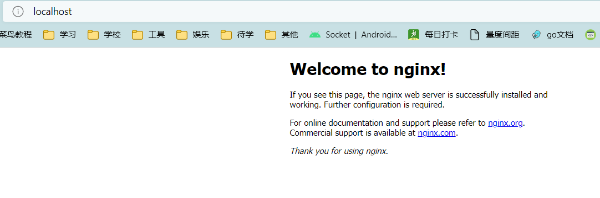
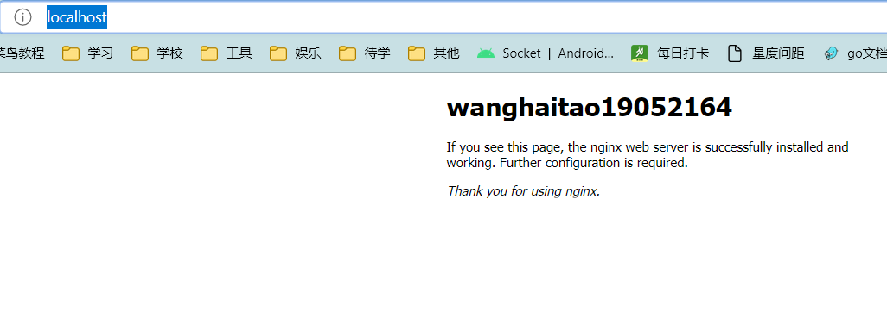

# 实验3存储: 打通容器的文件系统(难度: 低)

王海涛19052164

Volume的生命周期长于容器. 容器被删除不会影响到Volumes

mysql镜像,与redis镜像都在makefile中设置了Volumes文件夹保存数据

实验使用centos手动用vi修改源文件模拟开发环境网页源文件的改动

## 1. 初始化Nginx容器

运行nginx容器,同时创建Volumes

```shell
docker run --name nginx-test -p 80:80 -v nginx-vol:/usr/share/nginx/html:rw -d nginx
```

-v volume名称:映射文件夹路径:rw或ro代表可读写与只读

在volume不存在时会创建新volume

访问宿主机80端口检查容器运行结果



## 2. 初始化centos开发环境

运行centos镜像,并且链接Volumes

```shell
docker run -itd -v nginx-vol:/web:rw --name centos-test centos:centos7
```

## 3. 在宿主机检查实验结果

进入容器命令行, 修改网页html文件

```shell
docker exec -it <容器ID> bash
cd web/
vi index.html
```

vi按i进入编辑模式

按esc退出编辑模式

输入 :wq 写入文件并退出

在文件修改完成后

刷新

http://localhost/

网页,可以看到网站已经改变


