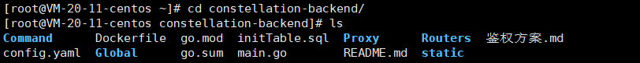
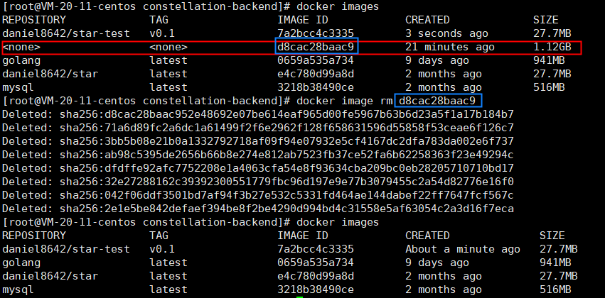

# 实验2镜像: 构建镜像并且上传镜像到dockerHub(难度: 高)

王海涛19052164

实验需求:

1. 已安装Docker
2. 可以访问DockerHub与Gitee的网络

## 1. 构建镜像

1. 使用git clone源代码或者在gitee下载下面项目的压缩包

   https://gitee.com/daniel8642/constellation-backend

   并且解压, 保证文件夹下有Dockerfile文件

2. cd到项目文件夹内,使用ls可以看到Dockerfile

   

3. 使用Dockerfile构建镜像

   ```shell
   docker build -t <你的DockerHub用户名>/star-test:v0.1 .
   ```

   star-test : 构建的镜像名

   v0.1: 版本
   
   . 使用本目录下的文件构建
   
   
   
   看见 Successfully tagged <你的DockerHub用户名>/star-test:v0.1 构建就完成了
   

## 2. 检查镜像并运行测试镜像

1. 使用docker images 打印镜像信息

   这里红色线上是我们要用的镜像

   蓝色是构建的中间镜像,可以删除

   

2. 使用docker image rm 删除无用镜像

   

3. 运行自己构建的镜像

   1. 运行数据库
   ```
   docker run -itd --name mysql -p 3306:3306 -e MYSQL_ROOT_PASSWORD=daniel8642 mysql
   ```
   2. 初始化数据库
   
      用MySQL-cli连接到机器3306端口
   
      创建数据库starWeb(与项目config.yaml中Mysql.database条目相同)
   
      ```
      create database starWeb;
      ```
   
      运行项目中initTable.sql中的数据表定义命令
   
   3. 运行镜像
   
      docker run -itd --name star-test -p 80:80  <自己构建的镜像ID>
   
      
   
      访问 <机器ip>/backend 可以显示网页即运行成功
   
      

## 3. 上传自定义镜像到DockerHub

要上传的镜像名称必须规范, 否则无法上传成功

镜像的完整名称是: 用户名称/仓库名称:TAG

如果名称不正确 可以使用docker tag 对镜像进行重命名

1. 使用docker login进行登录

   ```
   docker login
   ```

   输入后按照提示输入DockerHub的用户名和密码

2. docker push 用户名称/仓库名称:TAG 上传镜像

   

3. 在dockerHub就可以查看到上传上去的镜像

   
