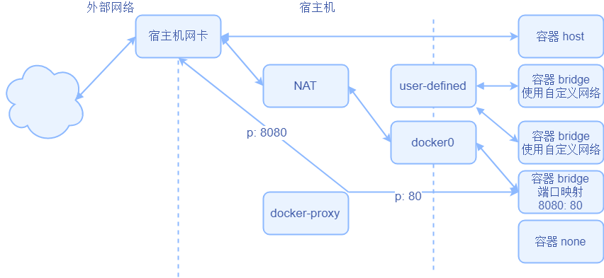
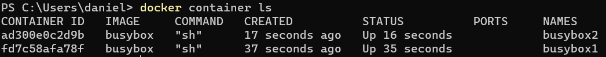
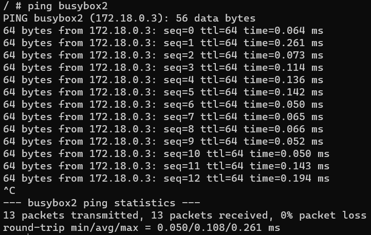
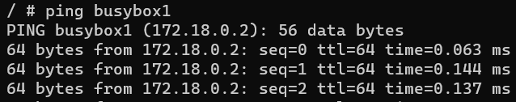

# 实验4网络: 让容器轻松互联(难度: 低)

王海涛19052164

docker中的网络实际上都是网络虚拟化解决方案, 这里介绍docker自带的三种single-host网络

- none
  - 相当于没有给容器连接网络, 适用与不需要网络连接的业务
  - 容器内网卡只有本地环回地址127.0.0.1
- host
  - 直接使用宿主机的网络, 容器系统申请到的端口对应宿主机的端口, 不需要定义开放的端口, 适合对传输效率有较高要求的容器,和一部分需要对网络进行配置的容器. 过度使用可能造成宿主机端口耗尽的问题
  - 容器内网卡和宿主机完全一样
- bridge
  - 默认的容器接入类型, 可以理解为容器被接入到虚拟的交换机. docker有一个默认的网桥docer0 网段是172.17.0.0/16 宿主机作为网关占用172.17.0.1
  - 容器内网卡有本地环回, 和连接到网桥的网卡(可能有多个)
- joined container
  - 类似host模式, 指定公用网络的容器
  - 容器内网卡和被join的容器一样
  - 模式比较特殊, 没有在下面图片中展示出来


用户还可以自己配置网络, 实现业务需求




实现容器之间相互访问有很多种方法

在实验一中, star项目中配置文件访问是数据库地址是172.17.0.1 .

这是docker中默认网桥docker0中宿主机的ip, 同时配置mysql容器映射到了宿主机3306端口

这一项实验我们将连接方式改为通过自定义网桥连接

## 1. 新建网络

先创建一个新的Docker网络

```shell
docker network create -d bridge my-net
```


## 2. 建立容器

运行一个容器, 并且连接到新建的网络

输入后终端会连接到容器内部, 保持这个终端不要关闭

```shell
docker run -it --rm --name busybox1 --network my-net busybox sh
```


打开一个新的终端,输入命令新建另外一个容器, 保持终端不关闭

```shell
docker run -it --rm --name busybox2 --network my-net busybox sh
```

此时容器信息



## 3. 连通性测试

在容器终端中相互ping

```shell
ping busybox1
```

```shell
ping busybox2
```





这里可以直接ping容器名,  因为docker在bridge型网络中默认开启dns解析. 可以把容器名解析成对应容器的ip

